# Praktikum 3 Sistem Administrasi Server  #

Abdillah Ainur Ridla (1202190060)

Abdul Muhaimin Nurdin (1202199001)

Create SubDomain dev.vm.local with rules :

- Ansible
- Same lxc like vm.local
- The folder must be in var/www/html/dev{name_app}

    - The first step is to go to the directory using ansible

    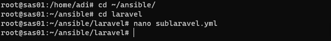

    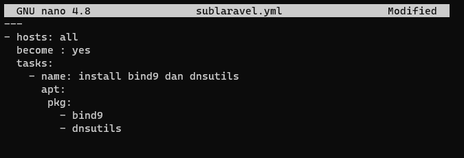

        ---
        - hosts: all
        become : yes
        tasks:
            - name: install bind9 dan dnsutils
            apt:
            pkg:
                - bind9
                - dnsutils

    - The next step is install packages with ansible

    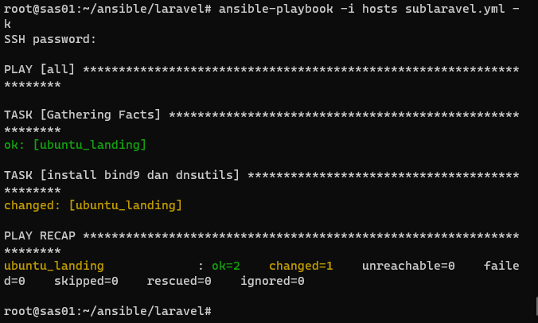

    - Create e config.yml file

    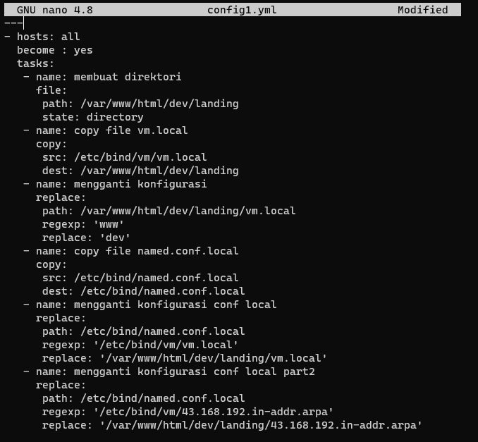

        ---
        - hosts: all
        become : yes
        tasks:
        - name: membuat direktori
            file:
            path: /var/www/html/dev/landing
            state: directory
        - name: copy file vm.local
            copy:
            src: /etc/bind/vm/vm.local
            dest: /var/www/html/dev/landing
        - name: mengganti konfigurasi
            replace:
            path: /var/www/html/dev/landing/vm.local
            regexp: 'www'
            replace: 'dev'
        - name: copy file named.conf.local
            copy:
            src: /etc/bind/named.conf.local
            dest: /etc/bind/named.conf.local
        - name: mengganti konfigurasi conf local
            replace:
            path: /etc/bind/named.conf.local
            regexp: '/etc/bind/vm/vm.local'
            replace: '/var/www/html/dev/landing/vm.local'
        - name: mengganti konfigurasi conf local part2
            replace:
            path: /etc/bind/named.conf.local
            regexp: '/etc/bind/vm/43.168.192.in-addr.arpa'
            replace: '/var/www/html/dev/landing/43.168.192.in-addr.arpa'
        - name: copy file 43.168.192.in-addr.arpa
            copy:
            src: /etc/bind/vm/43.168.192.in-addr.arpa
            dest: /var/www/html/dev/landing
        - name: copy file resolv.conf
            copy:
            src: /etc/resolv.conf
            dest: /etc/resolv.conf
        - name: copy file named.conf.options
            copy:
            src: /etc/bind/named.conf.options
            dest: /etc/bind/named.conf.options
        - name: restart nginx
            service:
            name: nginx
            state: restarted
        - name: restart bind9
            action: service name=bind9 state=restarted
    
    - Do the installation using the script below

    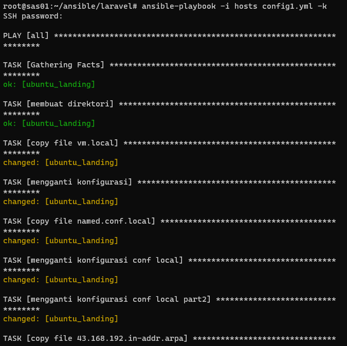

    - Add subdomain to /etc/hosts

    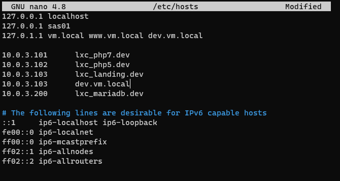

    - Open vm.local file

    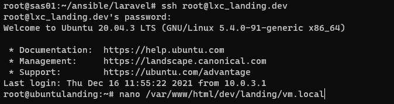

    - Add line www. After that exit lxc

    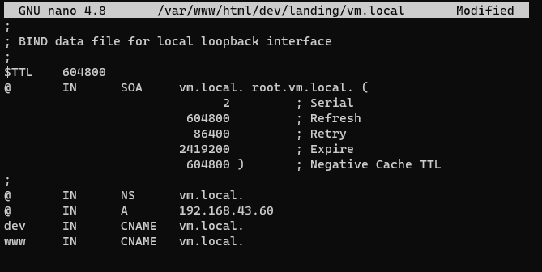

    - Open and edit vm.local in directory /etc/nginx/sites-enabled/

    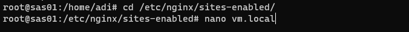

    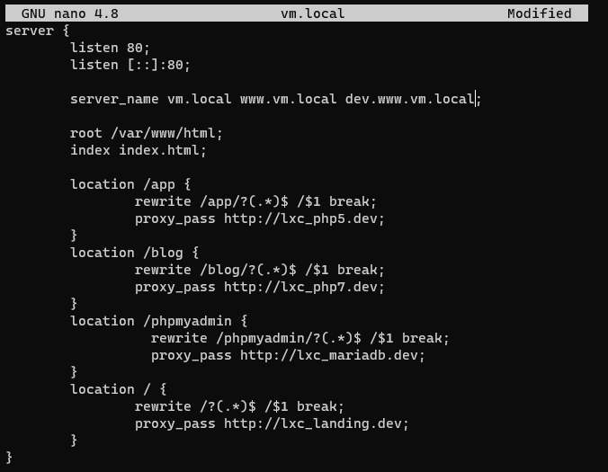

    - Open and edit vm.local in directory /etc/bind/vm/

    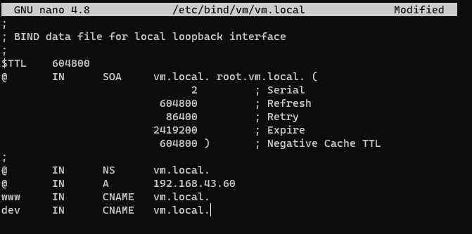

    - Restart all packages

    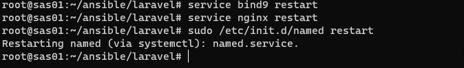

    - select internet protocol version (TCP/IPv4), then click properties

    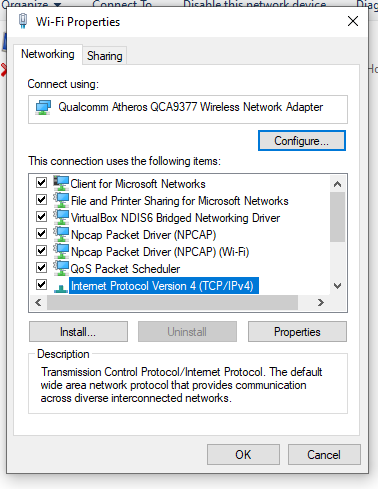

    - replace dns with ip

    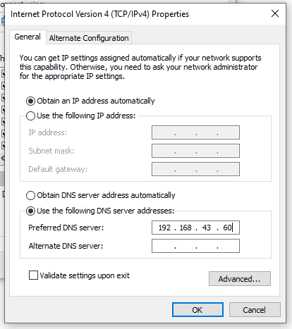

    - try to access dev.vm.local in the browser

    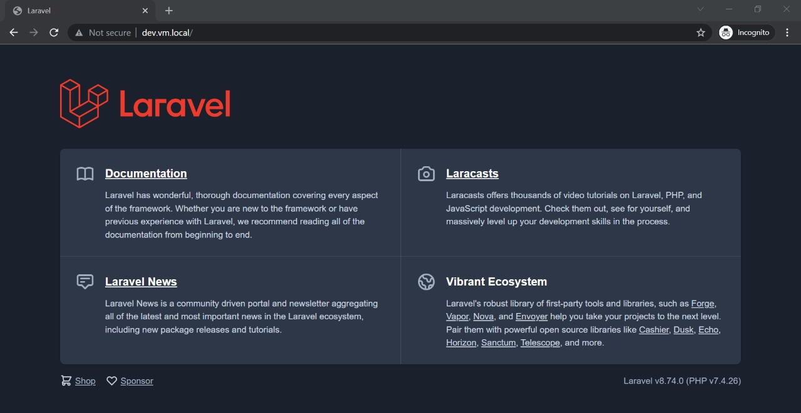

